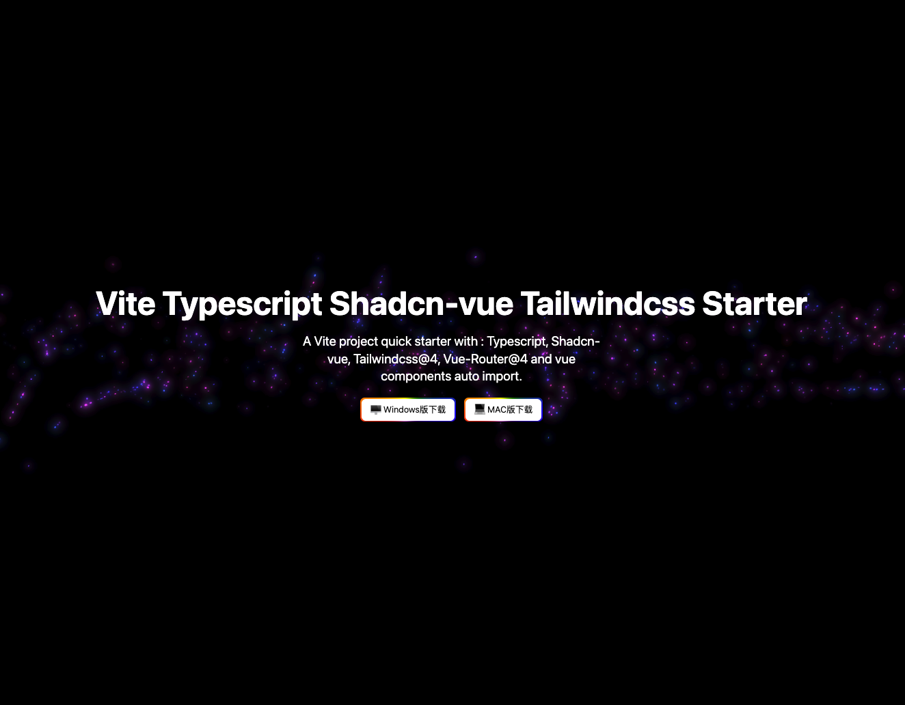

# Vite + Vue 3 + TypeScript + Tailwind CSS 啟動模板

[](https://github.com/zeeklog/zeek.ai-official-web/stargazers)
[](https://github.com/zeeklog/zeek.ai-official-web/network)
[](https://github.com/zeeklog/zeek.ai-official-web/issues)
[](https://github.com/zeeklog/zeek.ai-official-web/blob/main/LICENSE)
[](https://github.com/zeeklog/zeek.ai-official-web/releases)
[](https://github.com/zeeklog/zeek.ai-official-web/actions)

[English](README.md) | [简体中文](README.cn.md) | [繁體中文](README.hk.md) | [日本語](README.jp.md)



一個現代化的 Vue 3 啟動模板，集成了 Vite、TypeScript、Tailwind CSS 等工具。

## 特性

- ⚡️ [Vite 6](https://vitejs.dev/) - 極速構建工具
- 🖖 [Vue 3](https://vuejs.org/) - 漸進式 JavaScript 框架
- 🎨 [Tailwind CSS 4](https://tailwindcss.com/) - 實用優先的 CSS 框架
- 📦 [TypeScript](https://www.typescriptlang.org/) - 帶類型語法的 JavaScript
- 📱 [Vue Router](https://router.vuejs.org/) - Vue.js 官方路由
- 🗃️ [Pinia](https://pinia.vuejs.org/) - 您會喜歡使用的 Vue 狀態管理
- 🎯 [ESLint](https://eslint.org/) - 代碼檢查工具
- 💖 [Prettier](https://prettier.io/) - 代碼格式化工具
- 🛠️ [Biome](https://biomejs.dev/) - 代碼格式化和檢查
- 🔥 [Auto-imports](https://github.com/antfu/unplugin-auto-import) - 按需自動導入 API

## 快速開始

```bash
# 克隆倉庫
git clone https://github.com/zeeklog/zeek.ai-official-web.git

# 進入項目目錄
cd vite-ts-tailwind-starter

# 安裝依賴
pnpm install

# 啟動開發服務器
pnpm dev
```

## 可用腳本

- `pnpm dev` - 啟動開發服務器
- `pnpm build` - 構建生產版本
- `pnpm preview` - 預覽生產構建
- `pnpm start` - 啟動開發服務器並等待端口 3000

## 作者

- **姓名：** Ne0
- **郵箱：** 001@zeeklog.com
- **網站：** https://zeeklog.com 
